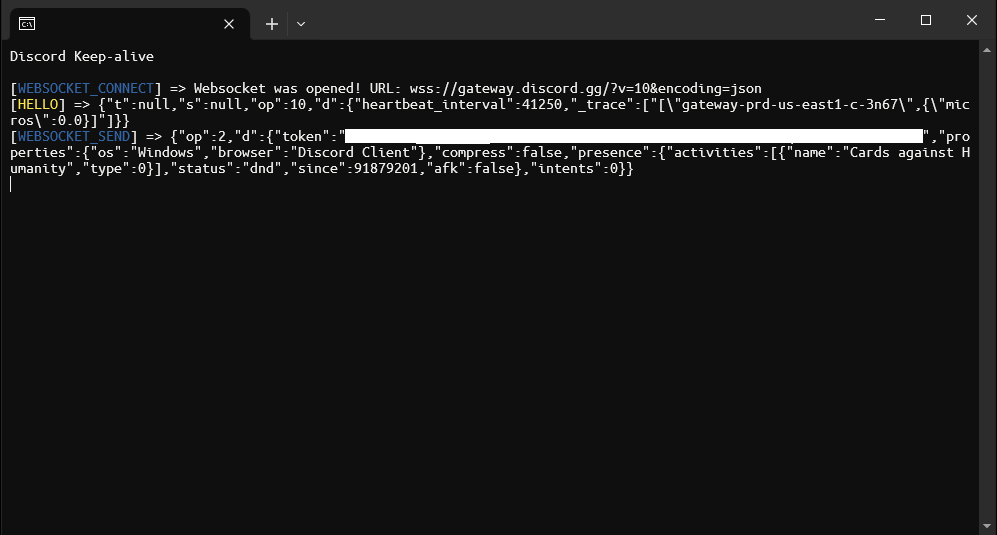

# discord-keepalive

Example application built with .NET 6.0 that maintains a persistent connection to the Discord Gateway.

## Installation and Usage

- Download the artifact build or compile it yourself.
- Navigate to the project directory and launch the program. It will create a `token.txt` file upon the first run.
- Open `token.txt` and paste the token into the file, then save and close it.

## Compatibility

- **Operating System**: Windows 10, Windows 11
- **Framework**: .NET 6.0

## License

This project is licensed under the MIT License. See the `LICENSE` file for details.

---

*Note: This application is an old example program, gateway structures and versions might change in the near future and break the functionality.* 
